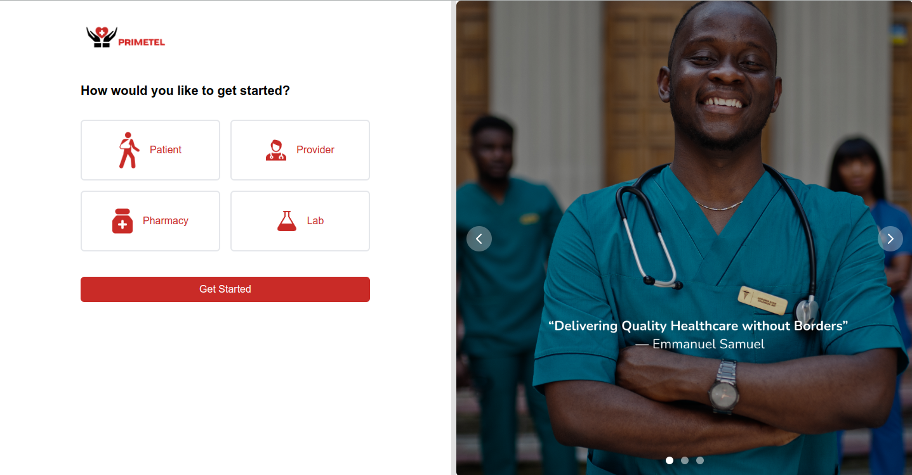
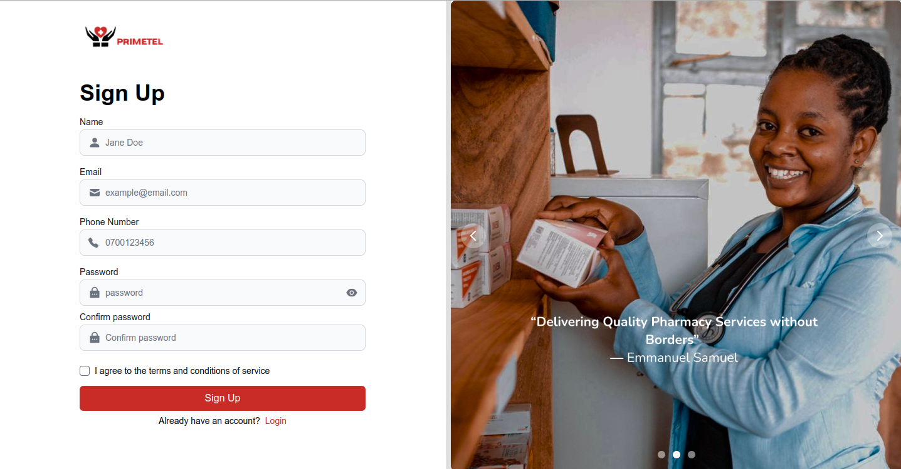
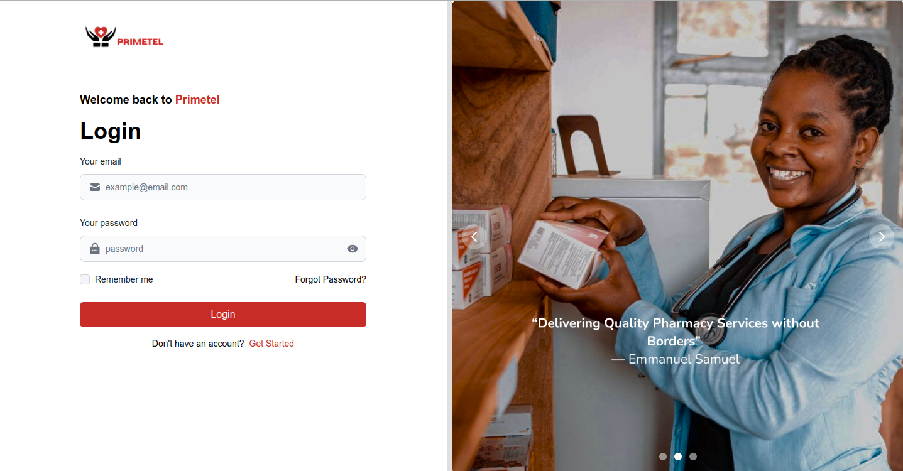
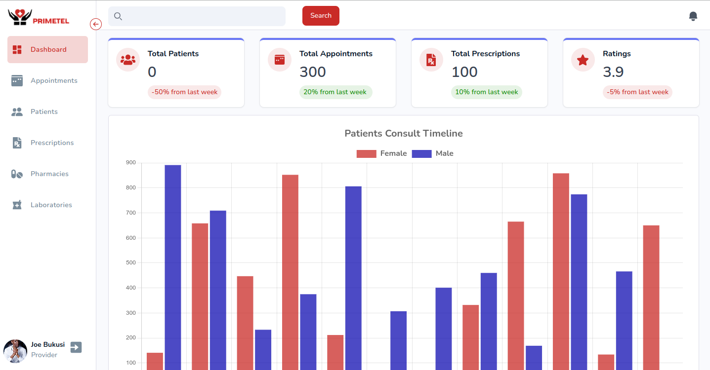
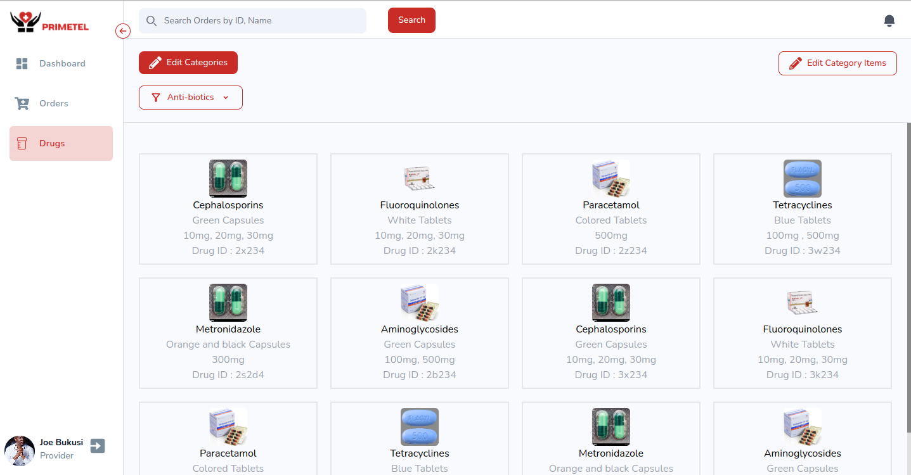
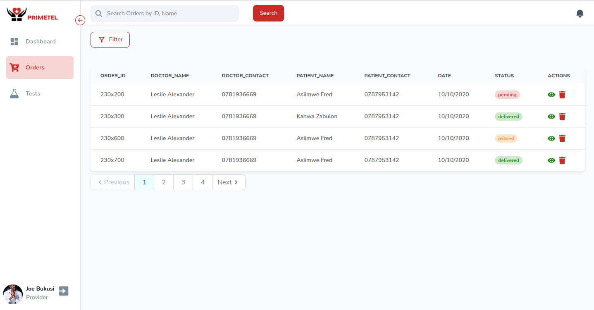

# Primetel Tele-Health Dashboard

Live demo: (https://primetel-dashboard.netlify.app/)

## Functionalities

1. Doctor can add and delete patients.
2. Doctor can add, edit and delete patient appointments.
3. Doctor can add, edit and delete patient prescription.
4. Pharmacies can add, edit and delete orders made.
5. Pharmacies can add, edit and delete drugs added in the system.
6. Laboratories can add, edit and delete tests made.
7. Laboratories can add, edit and delete test orders made.

## Prerequisites

1. Any Editor (Preferably VS Code)
2. Any web browser with latest version

## Languages and Technologies used

1. React js
2. Tailwind css (An HTML, CSS, and JS library)
3. Redux toolkit query (For data fetching and caching)

## Steps to run the project in your machine

### NOTE:

Currently we are using the json server for development purpose.

1. Clone or download the repository.
2. Run the json server using npm run server in the terminal.
3. With that you are able to run it and make it work.

## Getting into the Project

The figure below shows the signUp page through which doctors, pharmacies and laboratories create their accounts.

This figure below shows a sign-in page.

### Doctor Module

This module allows doctors to add in new patients and also view, add and delete prescriptions and tests made to patients.

### Pharmacy Module

This module allows Pharmacies to view, add, delete drugs plus also available orders made.

### Laboratory Module

This module allows Laboratories to view, add, delete tests plus also available orders made.

